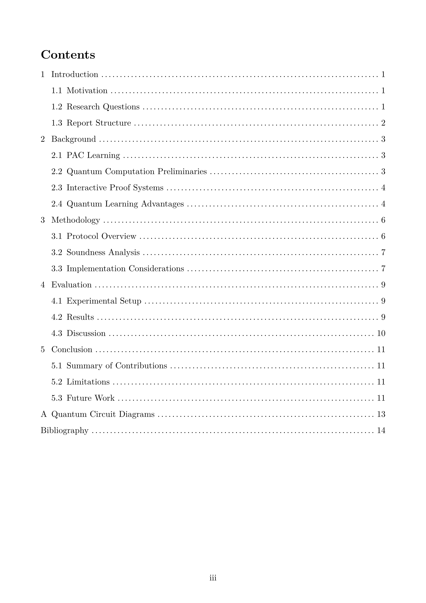
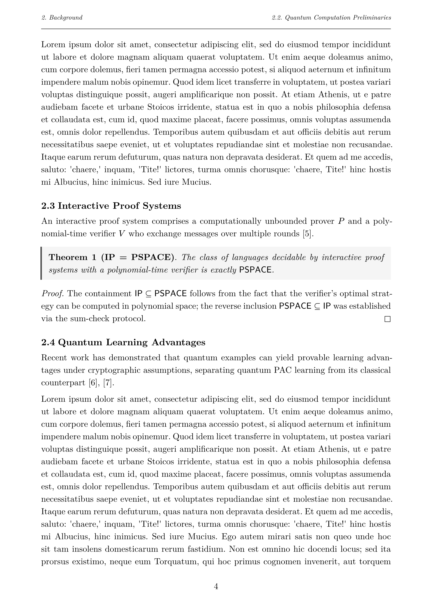
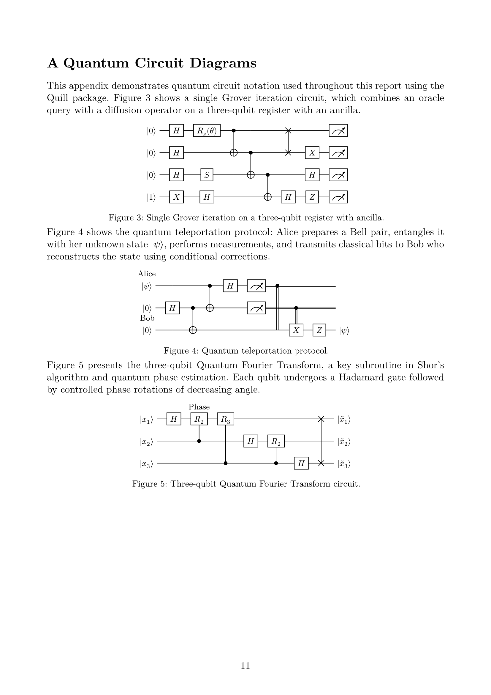
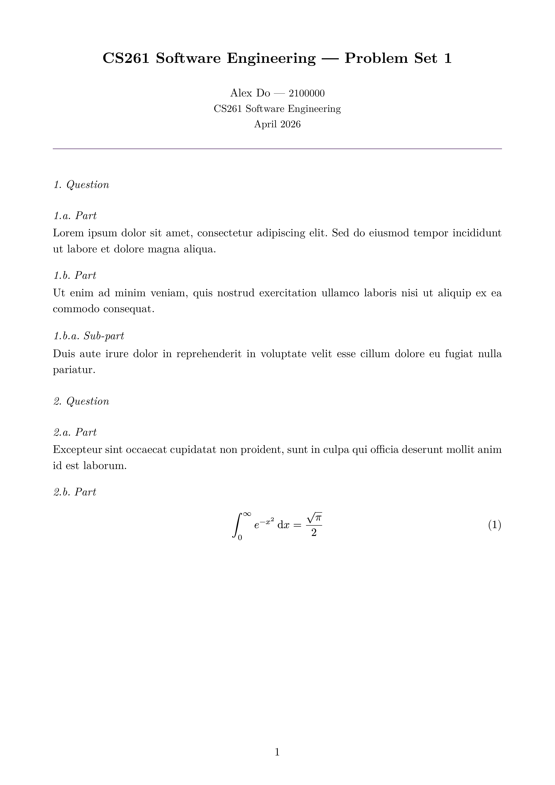

<div align="center">

[](https://typst.app/)
[](https://github.com/a1exxd0/uow-report-template/stargazers)
[](https://github.com/a1exxd0/uow-report-template/commits)
[](LICENSE)

# Plantilla de Reporte para la University of Warwick

Una plantilla de reporte académico limpia creada con [Typst](https://typst.app/), con dos estilos para elegir: un diseño de **reporte** completo (portada, índice, encabezados de capítulo, apéndices) y un diseño compacto de **conjunto de problemas** (problem set) para entregas cortas. Ambos incluyen entornos de teoremas, numeración de ecuaciones y soporte para bibliografía.

</div>

## Vista Previa

### Reporte

<p align="center">
  
  &nbsp;
  
  &nbsp;
  
</p>
<p align="center">
  <sub>Portada &bull; Índice &bull; Cuerpo del capítulo con entornos de teoremas</sub>
</p>

<p align="center">
  
</p>
<p align="center">
  <sub>Apéndice con diagramas de circuitos cuánticos</sub>
</p>

### Conjunto de Problemas (Problem Set)

<p align="center">
  
</p>
<p align="center">
  <sub>Encabezado compacto con numeración 1.a. para preguntas y partes</sub>
</p>

## Primeros Pasos

### Cómo usar esta plantilla

1. Haz clic en el botón verde **"Use this template"** en la parte superior de la página del repositorio y luego selecciona **"Create a new repository"**.
2. Elige un propietario y un nombre para el repositorio, luego haz clic en **"Create repository"**.
3. Clona tu nuevo repositorio y comienza a editar.

### Requisitos Previos

- [Typst](https://typst.app/) (`brew install typst` en macOS)

### Compilación

```sh
typst compile report.typ   # generar PDF
typst watch report.typ     # recompilar al detectar cambios

# Alternativamente para el conjunto de problemas
typst compile problem-set.typ
typst watch problem-set.typ
```

## Uso

La plantilla proporciona dos estilos. Importa el que necesites desde `template.typ`:

### Reporte (tesis, proyectos extensos)

```typ
#import "template.typ": report, theorem, definition, proof

#show: report.with(
  title: [Título de mi Reporte],
  author: "Tu Nombre",
  student-id: "2100000",
  supervisor: "Dr. Jane Smith",
  date: "Abril 2026",
)
```

Incluye una portada institucional, preliminares con numeración romana, índice, encabezados de capítulo y conteo de palabras. Agrega los capítulos como archivos `.typ` en `chapters/` e inclúyelos mediante `#include` en `main.typ`.

### Conjunto de Problemas (reportes cortos, tareas)

```typ
#import "template.typ": problem-set, theorem, definition, proof

#show: problem-set.with(
  title: [CS261 — Conjunto de Problemas 1],
  author: "Tu Nombre",
  student-id: "2100000",
  module: "CS261 Software Engineering",
  date: "Abril 2026",
)
```

Encabezado compacto, sin portada ni índice. Los encabezados utilizan numeración `1.a.` — `=` para preguntas, `==` para partes, `===` para sub-partes.

### Características compartidas

Ambos estilos proporcionan los entornos `theorem`, `corollary`, `lemma`, `definition` y `proof`, numeración de ecuaciones y soporte de bibliografía a través de `bibliography.bib`.
