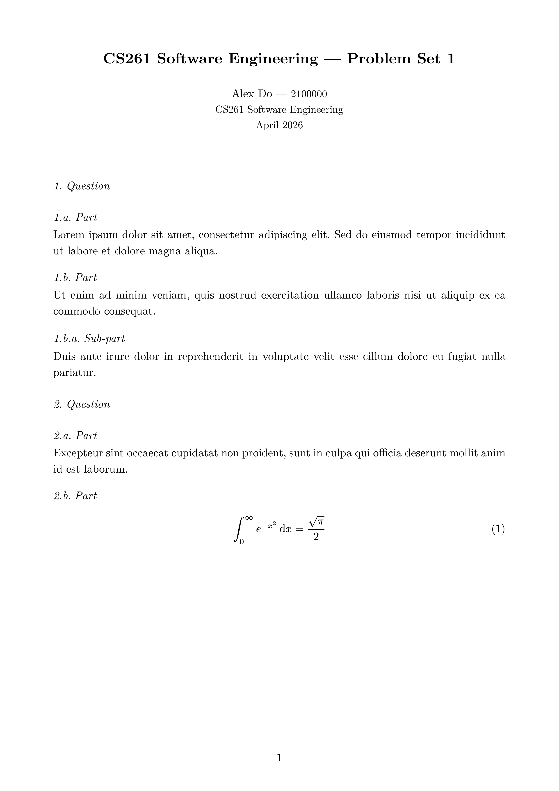

<div align="center">

[](https://typst.app/)
[](https://github.com/a1exxd0/uow-report-template/stargazers)
[](https://github.com/a1exxd0/uow-report-template/commits)
[](LICENSE)

# University of Warwick Report Template

A clean, academic report template built with [Typst](https://typst.app/), with two styles to choose from: a full **report** layout (title page, table of contents, chapter headers, appendices) and a compact **problem set** layout for short-form submissions. Both include theorem environments, equation numbering, and bibliography support.

</div>

## Preview

### Report

<p align="center">
  
  &nbsp;
  
  &nbsp;
  
</p>
<p align="center">
  <sub>Title page &bull; Table of contents &bull; Chapter body with theorem environments</sub>
</p>

<p align="center">
  
</p>
<p align="center">
  <sub>Appendix with quantum circuit diagrams</sub>
</p>

### Problem Set

<p align="center">
  
</p>
<p align="center">
  <sub>Compact header with 1.a. numbering for questions and parts</sub>
</p>

## Getting Started

### Use this template

1. Click the green **"Use this template"** button at the top of the repository page, then select **"Create a new repository"**.
2. Choose an owner and repository name, then click **"Create repository"**.
3. Clone your new repository and start editing.

### Prerequisites

- [Typst](https://typst.app/) (`brew install typst` on macOS)

### Build

```sh
typst compile report.typ   # build PDF
typst watch report.typ     # recompile on changes

# Alternatively for the problem set
typst compile problem-set.typ
typst watch problem-set.typ
```

## Usage

The template provides two styles. Import the one you need from `template.typ`:

### Report (dissertations, long-form projects)

```typ
#import "template.typ": report, theorem, definition, proof

#show: report.with(
  title: [My Report Title],
  author: "Your Name",
  student-id: "2100000",
  supervisor: "Dr. Jane Smith",
  date: "April 2026",
)
```

Includes a branded title page, roman-numeral front matter, table of contents, chapter headers, and word count. Add chapters as `.typ` files in `chapters/` and `#include` them in `main.typ`.

### Problem Set (short-form reports, assignments)

```typ
#import "template.typ": problem-set, theorem, definition, proof

#show: problem-set.with(
  title: [CS261 — Problem Set 1],
  author: "Your Name",
  student-id: "2100000",
  module: "CS261 Software Engineering",
  date: "April 2026",
)
```

Compact header, no title page or contents. Headings use `1.a.` numbering — `=` for questions, `==` for parts, `===` for sub-parts.

### Shared features

Both styles provide `theorem`, `corollary`, `lemma`, `definition`, and `proof` environments, equation numbering, and bibliography support via `bibliography.bib`.
