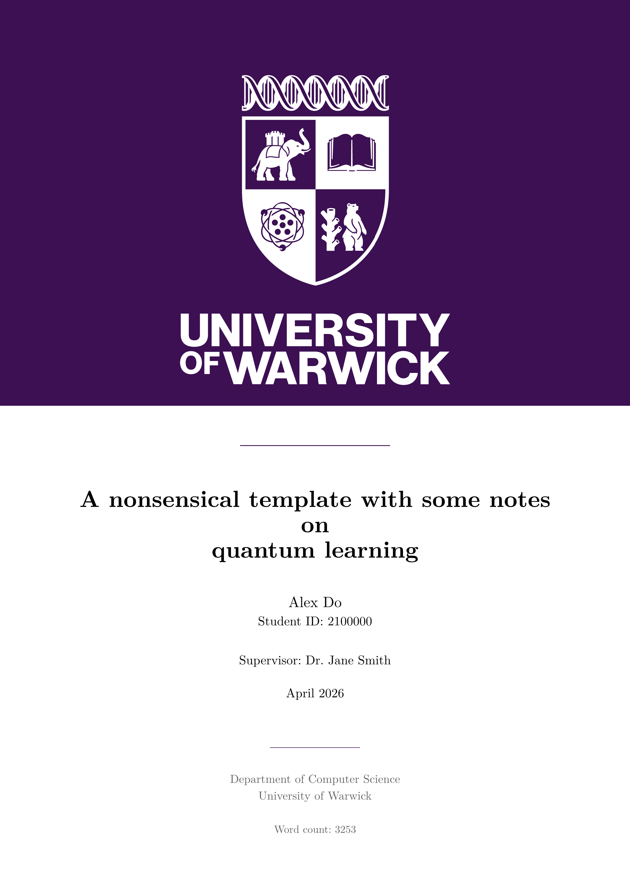
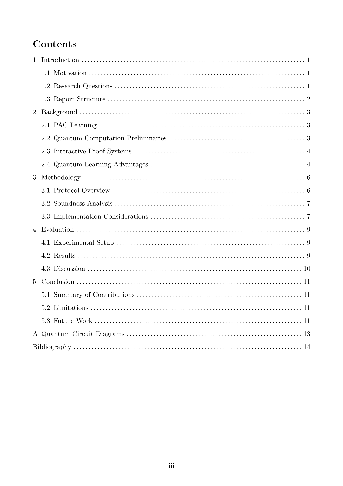
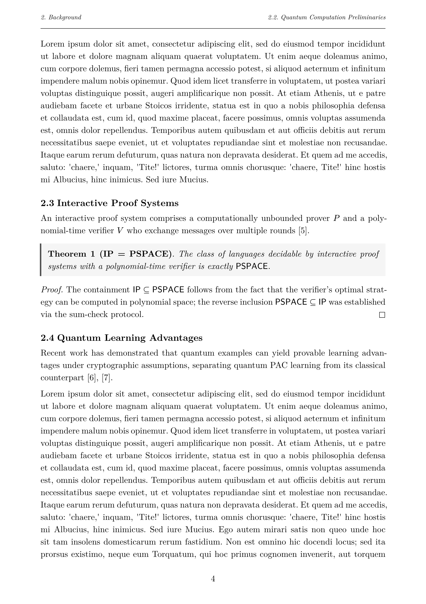
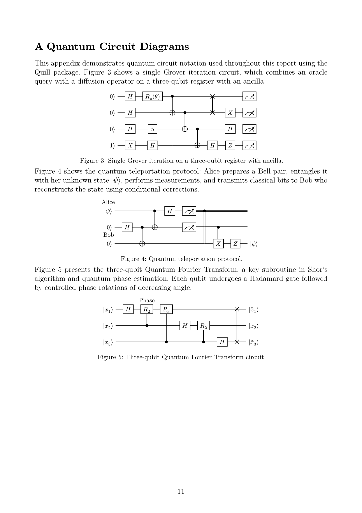

<div align="center">

[](https://typst.app/)
[](https://github.com/a1exxd0/uow-report-template/stargazers)
[](https://github.com/a1exxd0/uow-report-template/commits)
[](LICENSE)

# University of Warwick Report Template

A clean, academic report template built with [Typst](https://typst.app/), featuring title pages, table of contents, theorem environments, and appendix support.

</div>

## Preview

<p align="center">
  
  &nbsp;
  
  &nbsp;
  
</p>
<p align="center">
  <sub>Title page &bull; Table of contents &bull; Chapter body with theorem environments</sub>
</p>

<p align="center">
  
</p>
<p align="center">
  <sub>Appendix with quantum circuit diagrams</sub>
</p>

## Getting Started

### Use this template

1. Click the green **"Use this template"** button at the top of the repository page, then select **"Create a new repository"**.
2. Choose an owner and repository name, then click **"Create repository"**.
3. Clone your new repository and start editing.

### Prerequisites

- [Typst](https://typst.app/) (`brew install typst` on macOS)

### Build

```sh
typst compile main.typ   # build PDF
typst watch main.typ     # recompile on changes
```

## Usage

1. Edit `main.typ` to configure your title, author, student ID, supervisor, and date.
2. Add chapters as `.typ` files in `chapters/` and `#include` them in `main.typ`.
3. Use the environments provided by `template.typ`: `report`, `theorem`, `definition`, and `proof`.

Bibliography works the same as in LaTeX via `bibliography.bib`.
